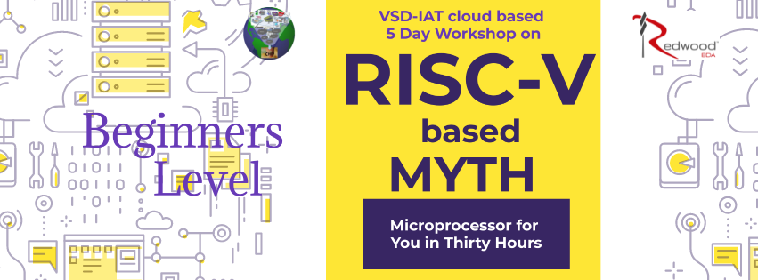

# RISC-V_based_MYTH
RISC-V based MYTH

### ABOUT THE WORKSHOP
The Workshop is a 5-day basic to advance program that is design for fresher and professional who wants to build a career in VLSI industry. It is a cloud based workshop that comprises of training courses that covers RISC-V specs, RISC-V software, How to implement RISC-V basic specs using TL-Verilog and Simulate your own RISC-V core. In short, you are going to write RTL and build RISC-V core on your own.
### AUTHOR OF THE WORKSHOP
#### Mr. Kunal Ghosh
Co-founder of VLSI System Design (VSD) Corporation Private Limited
### AGENDA
 [Day 1 : Introduction to RISC-V ISA and GNU compiler toolchain](#Day1)
  * [Part 1: Introduction to RISC-V basic keywords](#Part1-Introduction-to-RISC-V-basic-keywords)
  * [Part 2: Labwork for RISC-V software toolchain](#Part2-Labwork-for-RISC-V-software-toolchain)
  * [Part 3: Integer number representation](#Part3-Integer-number-representation)
 
 [Day 2: Introduction to ABI and basic verification flow](#Day2)
  * [Part 1: Application Binary interface (ABI)](#Part1-Application-Binary-Interface-ABI)
  * [Part 2: Lab work using ABI function calls](#Part2-Lab-work-using-ABI-function-calls)
  * [Part 3: Basic verification flow using iverilog](#Part3-Basic-verification-flow-using-iverilog)

 [Day 3 : Digital Logic with TL-Verilog and Makerchip](#Day3)
  * [Part 1: Combinational logic in TL-Verilog using Makerchip](#Part1-Combinational-logic-in-TL-Verilog-using-Makerchip)
  * [Part 2: Sequential and pipelined logic](#Part2-Sequential-and-pipelined-logic)
  * [Part 3: Validity](#Part3-Validity)
  * [Part 4: Hierarchy](#Part4-Hierarchy)

 [Day 4 : Basic RISC-V CPU micro-architecture](#Day4)
  * [Part 1: Microarchitecture and testbench for a simple RISC-V CPU](#Part1-Microarchitecture-and-testbench-for-a-simple-RISC-V-CPU)
  * [Part 2: Fetch, decode, and execute logic](#Part2-Fetch,-decode,-and-execute-logic)
  * [Part 3: RISC-V control logic](#Part3-RISC-V-control-logic)

 [Day 5 : Complete Pipelined RISC-V CPU micro-architecture/store](#Day5)
  * [Part 1: Pipelining the CPU](#Part1-Pipelining-the-CPU)
  * [Part 2: Load and store instructions and memory](#Part2-Load-and-store-instructions-and-memory)
  * [Part 3: Completing the RISC-V CPU](#Part3-Completing-the-RISC-V-CPU)
  * [Part 4: Wrap-up and future opportunities](#Part4-Wrap-up-and-future-opportunities)
  
## Day1
## Part1 Introduction to RISC-V basic keywords
## Part2 Labwork for RISC-V software toolchain
## Part3 Integer number representation
## Day2
## Part1 Application Binary interface (ABI)
## Part2 Lab work using ABI function calls
## Part3 Basic verification flow using iverilog
