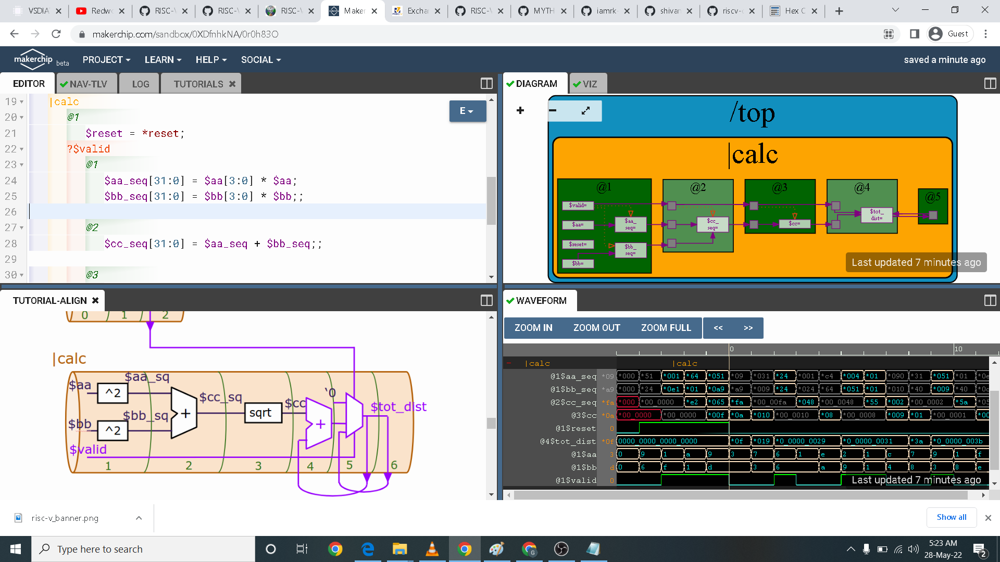
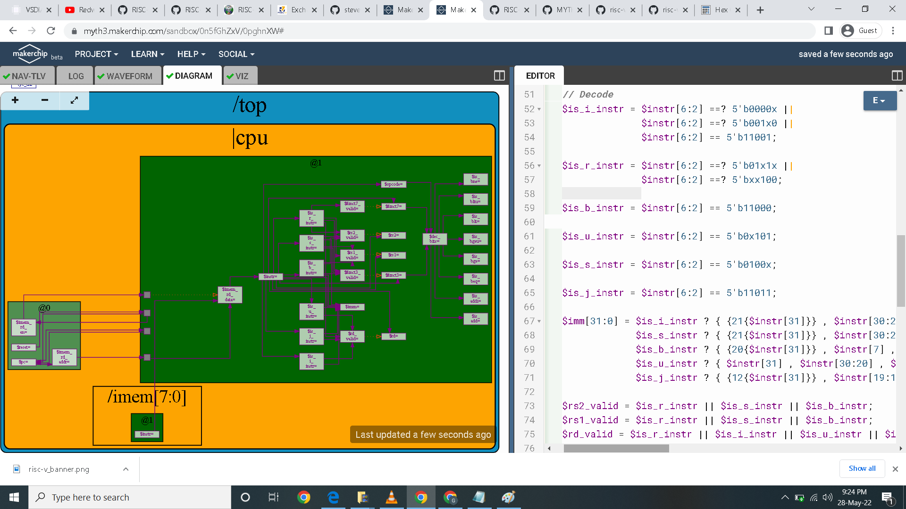

# RISC-V_based_MYTH
RISC-V based MYTH


### ABOUT THE WORKSHOP
The Workshop is a 5-day basic to advance program that is design for fresher and professional who wants to build a career in VLSI industry. It is a cloud based workshop that comprises of training courses that covers RISC-V specs, RISC-V software, How to implement RISC-V basic specs using TL-Verilog and Simulate your own RISC-V core. In short, you are going to write RTL and build RISC-V core on your own.
### AUTHOR OF THE WORKSHOP
#### Mr. Kunal Ghosh
Co-founder of VLSI System Design (VSD) Corporation Private Limited
#### Mr. Steve Hoover
Founder of RedwoodEDA Inc.
### AGENDA
 [Day 1 : Introduction to RISC-V ISA and GNU compiler toolchain](#Day1)
  * [Part 1: Introduction to RISC-V basic keywords](#Part1-Introduction-to-RISC-V-basic-keywords)
  * [Part 2: Labwork for RISC-V software toolchain](#Part2-Labwork-for-RISC-V-software-toolchain)
  * [Part 3: Integer number representation](#Part3-Integer-number-representation)
 
 [Day 2: Introduction to ABI and basic verification flow](#Day2)
  * [Part 1: Application Binary interface (ABI)](#Part1-Application-Binary-Interface-ABI)
  * [Part 2: Lab work using ABI function calls](#Part2-Lab-work-using-ABI-function-calls)
  * [Part 3: Basic verification flow using iverilog](#Part3-Basic-verification-flow-using-iverilog)

 [Day 3 : Digital Logic with TL-Verilog and Makerchip](#Day3)
  * [Part 1: Combinational logic in TL-Verilog using Makerchip](#Part1-Combinational-logic-in-TL-Verilog-using-Makerchip)
  * [Part 2: Sequential and pipelined logic](#Part2-Sequential-and-pipelined-logic)
  * [Part 3: Validity](#Part3-Validity)
  * [Part 4: Hierarchy](#Part4-Hierarchy)

 [Day 4 : Basic RISC-V CPU micro-architecture](#Day4)
  * [Part 1: Microarchitecture and testbench for a simple RISC-V CPU](#Part1-Microarchitecture-and-testbench-for-a-simple-RISC-V-CPU)
  * [Part 2: Fetch, decode, and execute logic](#Part2-Fetch,-decode,-and-execute-logic)
  * [Part 3: RISC-V control logic](#Part3-RISC-V-control-logic)

 [Day 5 : Complete Pipelined RISC-V CPU micro-architecture/store](#Day5)
  * [Part 1: Pipelining the CPU](#Part1-Pipelining-the-CPU)
  * [Part 2: Load and store instructions and memory](#Part2-Load-and-store-instructions-and-memory)
  * [Part 3: Completing the RISC-V CPU](#Part3-Completing-the-RISC-V-CPU)
  * [Acknowledgement](#Acknowledgement)
  
## Day1

## Part1 Introduction to RISC-V basic keywords
A RISC-V ISA is defined as a base integer ISA, which must be present in any implementation, plus optional extensions to the base ISA. Each base integer instruction set is characterized by
- Width of the integer registers (XLEN)
- Corresponding size of the address space
- Number of integer registers (32 in RISC-V)
More details on RISC-V ISA can be obtained here.
Overview of GNU compiler toolchain
The GNU Toolchain is a set of programming tools in Linux systems that programmers can use to make and compile their code to produce a program or library. So, how the machine code which is understandable by processer is explained below.
* Preprocessor - Process source code before compilation. Macro definition, file inclusion or any other directive if present then are preprocessed.
* Compiler - Takes the input provided by preprocessor and converts to assembly code.
* Assembler - Takes the input provided by compiler and converts to relocatable machine code.
* Linker - Takes the input provided by Assembler and converts to Absolute machine code.
Under the risc-v toolchain,
To use the risc-v gcc compiler use the below command:
```riscv64-unknown-elf-gcc -Ofast -mabi=lp64 -march=rv64i -o <object filename> <C filename>```
More generic command with different options:
```riscv64-unknown-elf-gcc <compiler option -O1 ; Ofast> <ABI specifier -lp64; -lp32; -ilp32> <architecture specifier -RV64 ; RV32> -o <object filename> <C filename>```
More details on compiler options can be obtained here
To view assembly code use the below command,
```riscv64-unknown-elf-objdump -d <object filename>```
To use SPIKE simualtor to run risc-v obj file use the below command,
```spike pk <object filename>```
To use SPIKE as debugger
```spike -d pk <object Filename>``` with degub command as ```until pc 0 <pc of your choice>```
To install complete risc-v toolchain locally on linux machine,
- RISC-V GNU Toolchain
- RISC-V ISA SImulator - Spike
Once done with installation add the PATH to .bashrc file for future use.

## Part2 Labwork for RISC-V software toolchain
Labs question:
1)   For the C program used in labs, use a value of n=9, compile and simulate using gcc compiler. What is the output you get?
```ans. 45```

2)   As shown in labs, compile the C program (n=9) using riscv-gcc compiler with O1 switch and look at assembly code using riscv-objdmp. What is the memory location of "printf" subroutine ?
```ans. 10408```

3)   How many instructions are used in "printf" subroutine for C program (n=9) compiled with riscv-gcc and O1 switch?
```ans. 21```

4)   As shown in labs, compile the C program (n=9) using riscv-gcc compiler with Ofast switch and look at assembly code using riscv-objdmp. How many instructions are used by "main" program ?
```ans. 11```

5)   Debug C program (n=9) with spike and run until PC is 100b0. What are the contents of register a0?
```ans. 1```

6)   Debug C program (n=9) with spike and run until PC is 100b0. What are the contents of register sp?
```ans. 0x0000003ffffffb40```

7)   Debug C program (n=9) with spike and run until PC is 100c4. What are the contents of register a0?
```ans. 21180```

8)   Debug C program (n=9) with spike and run until PC is 100dc. What is the output on shell?
```ans. Sum of numbers from 1 to 9 is 45```

## Part3 Integer number representation
Labs question:
In this lab u need to cast ```unsigned long long int``` before the pow function. To resolve the variable limitation of int.

4)   Modify the unsignedHighest.c program to display highest and lowest 64-bit signed integers. Debug using spike. Run until PC is 100d8. What message gets printed at this point?
```ans. highest number represented by signed long long int ...```
```highest number represented by signed long long int is 9223362036854775807 and lowest number represented by signed long long int is -9223362036854775808```

5)   Modify the unsignedHighest.c program to display highest and lowest 64-bit signed integers. View the assembly code using riscv-objdmp. What is the address location of "printf" subroutine ?
```ans. 10420```


## Day2

## Part1 Application Binary interface (ABI)
An Application Binary Interface is a set of rules enforced by the Operating System on a specific architecture. So, Linker converts relocatable machine code to absolute machine code via ABI interface specific to the architecture of machine.
So, it is system call interface used by the application program to access the registers specific to architecture. Overhere the architecture is RISC-V, so to access 32 registers of RISC-V below is the table which shows the calling convention (ABI name) given to registers for the application programmer to use.

## Part2 Lab work using ABI function calls
Labs question:
1)   Modify 1to9_custom.c and load.S as shown in video. What is the output of simulation with -Ofast ?
```ans. Sum of number from 1 to 9 is 45```


2)   What is the memory location of load subroutine?
```ans. 101bc```

3)   What is the memory location of loop subroutine?
```ans. 101c8```

4)   Open spike debugger and run 1to9_custom.o until PC is 100b0. What is the value of a0 and a1 registers?
```ans. 1 and 3ffffffb58```

5)   Open spike debugger and run 1to9_custom.o until PC is 100bc. What is the value of a0 and a1 registers?
```ans. 0x0 and 0xa```

## Part3 Basic verification flow using iverilog
Labs question:
1)   Git clone riscv\_workshop\_collaterals as shown in video. What is the value of mabi and march in rv32im.sh script for 1to9_custom.c riscv gcc command?

To answer this question first we need to clone to link for github workshops collateral as shown above. Then open labs folder.

Once your in the labs folder use command```chmod 777 rv32im.sh``` to acquire previlege access to the file rv32im.sh. To envole the shell script file use command ```./rv32im.sh```. A file will be generated as shown  above. Example files are .o, hex files etc. In this file use vim or less application to open the file rv32im.sh

Finally the answer is ```.ans ilp32 and rv32im``` as highlighted above.

## Day3
## Part1 Combinational logic in TL Verilog using Makerchip
An introduction to TL-Verilog was done and we implemented basic combinational and sequential logic using the same.This day finally ended with an implementation of a sequential cyclic calculator. For this, Makerchip IDE, which is an open source tool developed by Redwood EDA has been utilised.

TL-Verilog is an extension for System Verilog, moreover it acts as an higher level abstraction for System verilog which makes HDL implementation very easy and error free. Here we deal the design at a transaction level assuming the design as a pipeline, where inputs would be provided and output will be generated at the end of the pipeline.

Advantages :

Code reduction , and thus less chances of being bug prone.
In pipelining ,the flip flops,registers and other staged signals are implied from the context.
It is very easy to stage different sections without impacting the behaviour of the logic.
Validity feature which provides easier debugging, cleaner design, automated clock gating and better error checking capabilities.

In our first lab we implement basic inverter as shown below.

We then implement 2 input logic. In my case I chose Adder logic as shown.

Here we implement ternary operation for multiplexer.

We then move to arithmetic operation using vector signal as shown below.

Here we are task to demonstrate what we learn in the pas labs by implementing more complex combinational circuit like calculator as shown below.


## Part2 Sequential and pipelined logic
Here we implement a counter using ternary operation and using flipflop.

We then implement the febonacci example which is very semilar to the counter we implement above.

Below screenshot is the lab for sequential calculator. We use what we learn about sequential logic and combinational logic to implement the lab.

Here we are task to code the diagram as shown. Here I was able to replicate the diagram thanks to TL-verilog pipeline feature.


## Part3-Validity
In this lab we try to implement squareroot and using validity.

This is a build up of calculator from the previous lab and we are using validity function here as shown the waveform change to show valid signals.

Here we implement the 2 cycle calculator with validity.


## Day4

## Part1-Microarchitecture-and-testbench-for-a-simple-RISC-V-CPU

After building up strong basics built in TL-Verilog and digital design, and getting completely familiar with the Makerchip Platform, it was time to move on to the core aspect of the workshop, i.e. to build a RISC V core. On this day , the following basic blocks were implemented :

Program Counter (PC)
Imem-Rd ( Instruction Memory)
Instruction Decoder
Register File Read
Arithmatic Logic Unit (ALU)
Register File Write
Branch

## Part2-Fetch,-decode,-and-execute-logic
##### Fetch
The Program Counter (PC) holds the address of next Instruction
The Instruction Memory (IM) holds the set of instructions to be executed
During Fetch Stage, processor fetches the instruction from the IM pointed by address given by PC.

Six types of Instructions of RISC-V

R-type - Register
I-type - Immediate
S-type - Store
B-type - Branch (Conditional Jump)
U-type - Upper Immediate
J-type - Jump (Unconditional Jump)

The format of instruction includes Opcode, immediate value, source address, and destination address.

##### Next PC


##### Fetch


##### Decode



## Part3-RISC-V-control-logic

The Register file performs to two read and one write simultaneously.

Below is the input and output signal of File Refister.
Inputs:

Read_Enable - Enable signal to perform read operation
Read_Address1 - Address1 from where data has to be read
Read_Address2 - Address2 from where data has to be read
Write_Enable - Enable signal to perform write operation
Write_Address - Address where data has to be written
Write_Data - Data to be written at Write_Address
Outputs:

Read_Data1 - Data from Read_Address1
Read_Data2 - Data from Read_Address2

During Decode Stage, branch target address is calculated and fed into PC mux. Before Execute Stage, once the operands are ready branch condition is checked.
##### Register File Read and Write


##### Branch


## Day5
## Part1-Pipelining-the-CPU
Converting to non-pipelined to pipeline CPU can easily be done using TL-verilog.
Below is the screenshot of pipeline CPU.


## Part2-Load-and-store-instructions-and-memory
The branch and load will have 3 cycle delay. I added Data Memory 1 write/read memory.

Inputs:

Read_Enable - Enable signal to perform read operation
Write_Enable - Enable signal to perform write operation
Address - Address specified whether to read/write from
Write_Data - Data to be written on Address (Store Instruction)

Output:

Read_Data - Data to be read from Address (Load Instruction)

Below is the screenshot of pipelined CPU with Memory


## Part3-Completing-the-RISC-V-CPU
This part of the labs I added Jumps and completed Instruction Decode and ALU for all instruction present in RV32I base integer instruction set.

Below is Screenshot of Complete Pipelined RISC-V CPU.


## Acknowledgement

- Kunal Ghosh, Co-founder, VSD Corp. Pvt. Ltd.
- Steve Hoover, Founder, Redwood EDA
- Shivam Potdar, GSoC 2020 @fossi-foundation
- Vineet Jain, GSoC 2020 @fossi-foundation
- Shivani Shah
